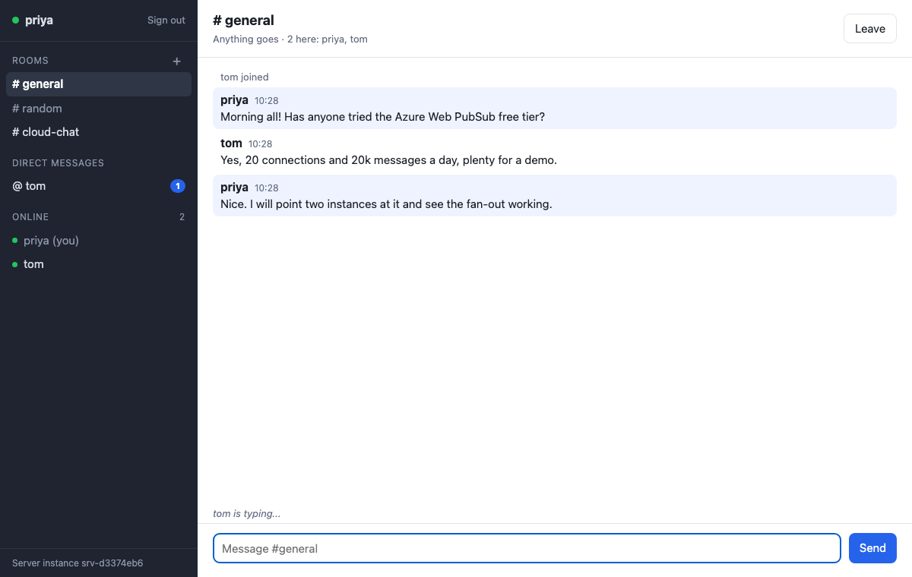
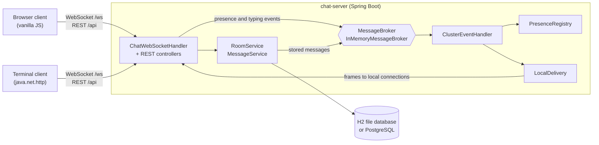
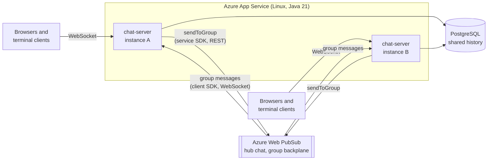
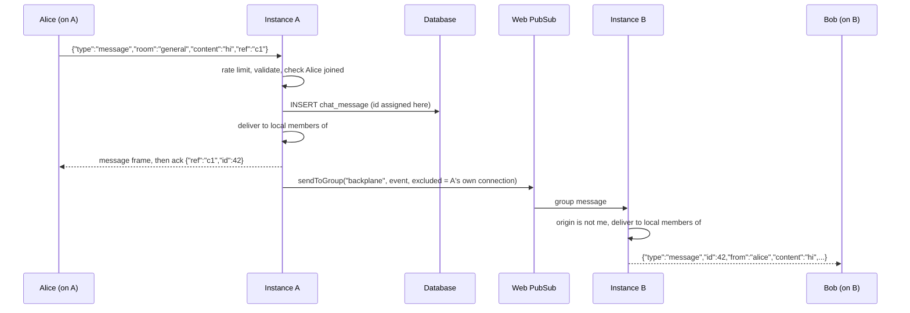

# Chat Application (Java and Azure)

A lightweight real-time chat application written in Java, designed to be deployed to Microsoft Azure. A Spring Boot server holds WebSocket connections and offers rooms (group chats), direct messages, presence (who is online, who is typing) and a persistent message history. Two clients talk to it: a browser client served by the server itself, and a terminal client written in plain Java, so there is Java on both ends of the wire. The point of the project is the cloud-ready design: message routing sits behind a `MessageBroker` interface, with a free in-memory implementation for a single server and an **Azure Web PubSub** implementation that lets several server instances on **Azure App Service** fan messages out to each other, so users connected to different instances still see each other in real time.

> **Honest status of the Azure path.** The Azure Web PubSub broker uses the official Java SDKs (`azure-messaging-webpubsub` and `azure-messaging-webpubsub-client`). It is tested with mocked SDK clients, with the real service SDK pointed at a local HTTP server standing in for Azure, and with two full server instances wired together through an in-memory fake of the service. It has **not** been run against a real Azure subscription, and the Bicep template and App Service plugin configuration have not been deployed. Everything else (server, both clients, H2 and PostgreSQL storage) is exercised end to end.



## Contents

- [Features](#features)
- [Architecture](#architecture)
- [Why Azure Web PubSub rather than Azure SignalR Service](#why-azure-web-pubsub-rather-than-azure-signalr-service)
- [Project structure](#project-structure)
- [Tech stack](#tech-stack)
- [Getting started](#getting-started)
- [Usage](#usage)
- [Configuration](#configuration)
- [Deploying to Azure](#deploying-to-azure)
- [Testing](#testing)
- [Design decisions](#design-decisions)
- [Limitations](#limitations)
- [Future work](#future-work)
- [Licence](#licence)

## Features

**Chat**

- **Rooms (group chats)**: two seeded rooms (`general`, `random`); anyone signed in can create more, with the id derived from the name (`"Java & Azure!"` becomes `java-azure`). A connection can be in several rooms at once.
- **Direct messages** between online users. Both directions share one conversation, and a message reaches every open tab of both participants.
- **Presence**: online and offline events, who is in each room, and typing indicators for rooms and direct conversations.
- **Message history** stored with Spring Data JPA (H2 file database by default, PostgreSQL through a profile), paged backwards with `?before=<id>&limit=<n>`. Messages are written to the database before they are broadcast, so anything seen live is also in history.
- **Username sessions**: pick any name that nobody online is using and receive an HMAC-signed session token. There are no passwords (see [Limitations](#limitations)).

**Server**

- Spring Boot 3.5 on Java 21, plain WebSocket at `/ws` with a small JSON protocol, and a REST API under `/api` for sessions, rooms, members and history.
- **Input validation** shared by server and clients: canonical lower-case usernames, URL-safe room ids, message text normalised to Unicode NFC with control and invisible formatting characters (such as bidi overrides) removed, and length limits counted in code points.
- **Rate limiting** with token buckets: messages and typing signals per user, sign-ins per client address, room creation per user. Plus guard rails: connections per user, rooms per connection, total rooms, a frame size limit, an authentication timeout and back-pressure for slow clients.
- Errors are reported the same way on both interfaces: an `error` frame with a stable `code` over the WebSocket, and an RFC 9457 problem response with the same `code` over REST.
- Spring Boot Actuator health (`/actuator/health`, with liveness and readiness groups and a `broker` component) and info (`/actuator/info`: instance id, broker type, connection and user counts).
- Same-origin WebSocket policy by default, with extra origins configurable.

**Messaging backplane (`MessageBroker`)**

- `InMemoryMessageBroker` (default): in-process delivery, correct for one instance, costs nothing.
- `AzureWebPubSubBroker`: each server instance joins one Azure Web PubSub group and publishes to it, so every instance receives every event. Selected with the `azure` Spring profile and configured with environment variables (a connection string, or an endpoint plus managed identity).
- Presence stays consistent across instances through per-instance views, periodic snapshots that double as heartbeats, expiry of silent instances and a goodbye message on clean shutdown.

**Clients**

- **Browser client** (vanilla JavaScript, no build step), served at `/`: sign-in, room list with unread badges, room creation, online list (click a name to message them), direct-message list, history with "load older", typing indicator, automatic reconnect with back-off that rejoins rooms and fetches anything missed, light and dark themes. Message text is always rendered as text, never as HTML.
- **Terminal client** (`chat-cli`), built only on `java.net.http` (`HttpClient` and `WebSocket`) plus the shared protocol module: slash commands for rooms, direct messages, history and presence, optional colour, keep-alive pings, and automatic reconnection that rejoins rooms.

**Deployment**

- Bicep template for an App Service plan and Linux web app (Java 21, WebSockets on) plus a Web PubSub service, defaulting to the free tiers.
- `azure-webapp-maven-plugin` configuration in an opt-in Maven profile.
- Multi-stage `Dockerfile` running as a non-root user.
- A GitHub Actions workflow that runs `./mvnw verify` on every push.

## Architecture

### Local mode (default)

One server process; the in-memory broker hands every event straight back to the same process.



### Azure mode (scaled out)

Clients still connect to the chat server, not to Web PubSub. Each instance keeps one extra WebSocket open to Web PubSub (via the client SDK) as a member of the `backplane` group, and publishes events to that group with the service SDK. History lives in a shared PostgreSQL database.



A room message from a user on instance A reaching a user on instance B:



**Presence across instances.** Each instance tells the others when a user's *first* connection opens, their *last* connection closes, and when they first enter or finally leave a room. The `PresenceRegistry` keeps a separate view per instance (user to rooms); a user is online if any instance lists them. Every 60 seconds each instance also broadcasts a full snapshot of its users, which corrects anything missed and acts as a heartbeat: an instance silent for 180 seconds is presumed dead and its users go offline. A newly started instance asks the others for their snapshots at once, and a cleanly stopping instance announces its departure so its users disappear immediately. Every change to the registry returns the resulting cluster-wide deltas (came online, joined room, left room, went offline), which are pushed to clients.

### Why Azure Web PubSub rather than Azure SignalR Service

The original idea mentioned Azure SignalR. Azure SignalR Service is built around the ASP.NET SignalR protocol: its server-side integration is designed for ASP.NET Core applications, with a "serverless" REST mode as the alternative. There is no official Java server SDK for it. **Azure Web PubSub** is Microsoft's managed service for plain WebSocket publish and subscribe, and it has official, generally available Java SDKs for both the service side (send to groups, users or connections; mint client tokens) and the client side (connect, receive group messages). For a Spring Boot server with its own JSON protocol it is the natural fit, and it has a free tier.

The service is used as a **backplane between server instances** rather than as the endpoint clients connect to. That keeps the clients identical in every mode (they always speak the same protocol to the same server), keeps validation, rate limiting and persistence on the server, and means the local, free mode is not a second-class code path.

## Project structure

```
Chat-Application-Java-and-Azure-/
├── pom.xml                      parent POM (Spring Boot 3.5 parent, Azure SDK BOM)
├── mvnw, mvnw.cmd, .mvn/        Maven Wrapper (the only build tool needed)
├── chat-protocol/               shared by server and terminal client
│   └── ClientFrame, ServerFrame   sealed interfaces of records, one per JSON frame type
│       ChatRules                  validation and normalisation (usernames, room ids, text)
│       ErrorCode, CloseCodes      stable error codes and WebSocket close codes
├── chat-cli/                    terminal client
│   └── ChatCli (main), ChatShell (session), ChatConnection (WebSocket),
│       ChatApi (REST), CommandParser, Renderer
├── chat-server/                 Spring Boot server
│   ├── src/main/java/.../server/
│   │   ├── auth/                  HMAC session tokens, bearer-token interceptor, /api/sessions
│   │   ├── cluster/               ChatEvent, MessageBroker, InMemoryMessageBroker,
│   │   │   │                      ClusterEventHandler, PresenceHeartbeat, health and info
│   │   │   └── azure/             AzureWebPubSubBroker and its Spring configuration
│   │   ├── config/                ChatProperties, WebSocket and web configuration
│   │   ├── message/               ChatMessage entity, MessageService, history endpoints
│   │   ├── presence/              PresenceRegistry (cluster-wide view), presence endpoints
│   │   ├── ratelimit/             token buckets
│   │   ├── room/                  Room entity, RoomService, room endpoints
│   │   ├── web/                   ChatException and the problem-details handler
│   │   └── ws/                    ChatWebSocketHandler, ConnectionRegistry, LocalDelivery
│   ├── src/main/resources/
│   │   ├── application*.yml       default, postgres and azure profiles
│   │   ├── db/migration/          Flyway migration (valid on H2 and PostgreSQL)
│   │   └── static/                browser client (index.html, app.js, style.css)
│   └── src/test/                  unit, integration and end-to-end tests
├── infra/main.bicep             App Service plan + web app + Web PubSub
├── Dockerfile, .dockerignore
├── Makefile                     shortcuts for build, test, run and the terminal client
├── .github/workflows/ci.yml     runs ./mvnw verify on every push
├── .env.example                 every environment variable, documented
└── docs/browser-client.png      screenshot captured from a real run
```

## Tech stack

| Area | Choice |
|---|---|
| Language | Java 21 (records, sealed interfaces, pattern-matching `switch`) |
| Server | Spring Boot 3.5.16: Web MVC, WebSocket, Data JPA, Validation, Actuator |
| Database | H2 2.3 (file) by default, PostgreSQL via profile; Flyway migrations; Hibernate schema validation |
| Azure | `azure-messaging-webpubsub` 1.5.6, `azure-messaging-webpubsub-client` 1.1.9, `azure-identity` 1.18.4 (via `azure-sdk-bom` 1.3.8) |
| JSON | Jackson (one shared mapper configuration in `chat-protocol`) |
| Terminal client | `java.net.http.HttpClient` and `java.net.http.WebSocket`, packaged as one runnable jar |
| Browser client | HTML, CSS and JavaScript modules, no framework or build step |
| Build | Maven 3.9.16 through the Maven Wrapper, multi-module |
| Tests | JUnit 5, AssertJ, Mockito, Spring Boot Test, embedded PostgreSQL 17 (zonky) |
| Deployment | Bicep, `azure-webapp-maven-plugin` 2.14.1, Docker |

Versions are pinned in the POMs (directly, or through the Spring Boot parent and the Azure SDK BOM) and are the ones the test suite was run with.

## Getting started

**Prerequisite:** JDK 21. Nothing else: the Maven Wrapper downloads Maven on first use (and checks its SHA-256).

```bash
git clone https://github.com/Omith786/Chat-Application-Java-and-Azure-.git
cd Chat-Application-Java-and-Azure-

./mvnw -DskipTests package          # or: make build     (Windows: mvnw.cmd -DskipTests package)
java -jar chat-server/target/chat-server.jar     # or: make run
```

The server listens on <http://localhost:8080> and stores its database under `./data`. Open that address in two browser windows (use a private window for the second, so each has its own session), sign in with two different names and start chatting.

**Terminal client**, in another terminal:

```bash
java -jar chat-cli/target/chat-cli-1.0.0-all.jar --user alice     # or: make cli NAME=alice
java -jar chat-cli/target/chat-cli-1.0.0-all.jar --server https://<app>.azurewebsites.net --user bob
```

Options: `--server URL` (default `$CHAT_SERVER` or `http://localhost:8080`), `--user NAME` (asked for if omitted), `--room ROOM` (joined on start; default `general`, `none` to skip) and `--no-color`.

**PostgreSQL instead of H2** (for example `docker run -e POSTGRES_USER=chat -e POSTGRES_PASSWORD=chat -e POSTGRES_DB=chat -p 5432:5432 postgres:17`):

```bash
SPRING_PROFILES_ACTIVE=postgres DATABASE_URL=jdbc:postgresql://localhost:5432/chat \
DATABASE_USERNAME=chat DATABASE_PASSWORD=chat java -jar chat-server/target/chat-server.jar
```

Flyway creates the schema on first start with either database.

## Usage

### Terminal client

```
/join <room>        join a room and switch to it
/leave [room]       leave a room (default: the current one)
/switch <room>      send plain text to a room you have joined
/switch @<user>     send plain text to a user as direct messages
/dm <user> <text>   send one direct message
/rooms              list rooms
/create <name>      create a room
/who [room]         who is online, or who is in a room
/history [n]        show the last n messages here (default 20)
/quit               disconnect and exit
//text              send text that starts with '/'
```

A real session between two terminal clients, with input piped in and colour off. Alice's side:

```
* Signed in as alice on srv-36d8a631. Online: alice, bob
* Recent messages in #general:
[10:37] #general <bob> hello from bob
* Type /help for commands.
* You joined #general (alice, bob)
* #general  General (2 online) - Anything goes
  #random  Random (0 online) - Off-topic chatter
* Online (2): alice, bob
[10:37] #general <alice> hi bob, it is alice
[10:37] [dm] you -> bob: see you at the stand-up
* bob left #general
* bob went offline
```

And Bob's:

```
* Signed in as bob on srv-36d8a631. Online: bob
* Type /help for commands.
* You joined #general (bob)
[10:37] #general <bob> hello from bob
* alice is online
* alice joined #general
[10:37] #general <alice> hi bob, it is alice
[10:37] [dm] alice -> you: see you at the stand-up
```

### WebSocket protocol

Connect to `/ws`, then send `{"type":"auth","token":"..."}` within 10 seconds. Every frame is a JSON object with a `type`.

| Client to server | Fields | Reply |
|---|---|---|
| `auth` | `token` | `welcome` (`user`, `online`, `instance`) |
| `join` / `leave` | `room` | `joined` (`room`, `members`) / `left` |
| `message` | `room`, `content`, optional `ref` | `message` to the room, `ack` (`ref`, `id`) to the sender |
| `direct` | `to`, `content`, optional `ref` | `direct` to both participants, `ack` to the sender |
| `typing` | exactly one of `room` or `to` | `typing` to the others |
| `ping` | | `pong` |

The server also pushes `presence` (`user`, `online`), `membership` (`room`, `user`, `joined`), `room_created` and `error` (`ref`, `code`, `message`). Error codes include `invalid`, `bad_frame`, `unauthorised`, `rate_limited`, `no_such_room`, `not_in_room`, `user_offline` and `limit_reached`. The server closes the connection with `4401` for an invalid token, `4408` if no auth frame arrives in time and `4409` when a user already has the maximum number of connections.

### REST API

All endpoints except `POST /api/sessions` need `Authorization: Bearer <token>`.

| Method and path | Purpose |
|---|---|
| `POST /api/sessions` `{"username":"alice"}` | Sign in; returns `username`, `token`, `expiresAt` (409 if the name is online) |
| `GET /api/sessions/me` | Who the token belongs to |
| `GET /api/rooms` | Rooms with online counts |
| `POST /api/rooms` `{"name":"...","description":"..."}` | Create a room (optional `id`) |
| `GET /api/rooms/{id}` | One room |
| `GET /api/rooms/{id}/messages?before=&limit=` | Room history, oldest first (limit 1 to 100, default 50) |
| `GET /api/rooms/{id}/members` | Users currently in a room |
| `GET /api/users/online` | Everyone online, across all instances |
| `GET /api/direct` | Your direct conversations with their latest message |
| `GET /api/direct/{user}/messages?before=&limit=` | History with one user |
| `GET /actuator/health`, `GET /actuator/info` | Health (including the `broker` component) and instance details |

```bash
TOKEN=$(curl -s -X POST localhost:8080/api/sessions -H 'Content-Type: application/json' \
  -d '{"username":"alice"}' | jq -r .token)
curl -s localhost:8080/api/rooms/general/messages?limit=5 -H "Authorization: Bearer $TOKEN"
```

## Configuration

Settings live in `chat-server/src/main/resources/application*.yml`. Every one can be overridden by an environment variable (Spring's relaxed binding: `chat.limits.max-rooms` becomes `CHAT_LIMITS_MAX_ROOMS`). `.env.example` lists them all; `make run` loads a `.env` file if present.

| Variable | Default | Purpose |
|---|---|---|
| `CHAT_SESSION_SECRET` | random per start | HMAC key for session tokens, 32+ characters. **Required** and identical on all instances when using the Azure broker |
| `CHAT_DATA_DIR` | `./data` (`/home/data` in the `azure` profile) | Where the H2 database file lives |
| `PORT` / `SERVER_PORT` | `8080` | HTTP port |
| `SPRING_PROFILES_ACTIVE` | none | `postgres`, `azure`, or `azure,postgres` |
| `DATABASE_URL`, `DATABASE_USERNAME`, `DATABASE_PASSWORD` | `jdbc:postgresql://localhost:5432/chat`, `chat`, `chat` | PostgreSQL connection (`postgres` profile) |
| `AZURE_WEBPUBSUB_CONNECTION_STRING` | none | Web PubSub connection string (`azure` profile) |
| `AZURE_WEBPUBSUB_ENDPOINT` | none | Alternative to the connection string: endpoint plus `DefaultAzureCredential` (managed identity on App Service, `az login` locally) |
| `AZURE_WEBPUBSUB_HUB` | `chat` | Web PubSub hub name |
| `CHAT_ALLOWED_ORIGINS` | none | Extra browser origins allowed to open the WebSocket |
| `CHAT_INSTANCE_ID` | `srv-<random>` | Instance id shown to clients and used by the backplane |
| `CHAT_PRESENCE_SNAPSHOT_INTERVAL`, `CHAT_PRESENCE_EXPIRY` | `60s`, `180s` | Heartbeat interval and dead-instance timeout |
| `CHAT_RATE_LIMITS_MESSAGES_CAPACITY`, `..._REFILL_PERIOD` | `10`, `500ms` | Burst size and refill rate for messages (similar keys for `typing`, `sessions`, `rooms`) |
| `CHAT_LIMITS_CONNECTIONS_PER_USER`, `..._ROOMS_PER_CONNECTION`, `..._MAX_ROOMS` | `5`, `50`, `200` | Guard rails |

## Deploying to Azure

### Costs and accounts: read this first

- **An Azure account needs a payment card for identity verification**, even on the free account. If you are a student, **Azure for Students** needs only a university email address, no card, and comes with a small credit.
- The defaults here are the **free tiers**: App Service **F1** and Web PubSub **Free_F1**. At the time of writing, F1 gives 60 CPU minutes a day, 1 GB of memory, no Always On (the app sleeps when idle and takes a few seconds to wake) and **a single instance only**, with a low cap on concurrent WebSocket connections. Web PubSub Free_F1 allows 20 concurrent connections and 20,000 messages a day. Check Microsoft's current pricing pages before relying on these numbers.
- **Scaling out costs money.** Running two or more App Service instances needs the Basic (B1) tier or above, and more than a handful of users on Web PubSub needs Standard_S1. A shared PostgreSQL database (Azure Database for PostgreSQL Flexible Server) is also a paid service outside any free-account allowance. Set a budget alert in Cost Management before changing any SKU.
- With one F1 instance the Web PubSub backplane is not strictly needed (there is nobody to fan out to), but deploying it shows the full topology and costs nothing on Free_F1. Its quota use is small: each instance broadcasts a presence snapshot once a minute and each event is delivered to the *other* instances only (the sender's own connection is excluded).
- Delete everything when you are done: `az group delete -n rg-chat`.

### Option 1: Bicep, then deploy the jar

```bash
az login
az group create -n rg-chat -l uksouth

az deployment group create -g rg-chat -f infra/main.bicep \
  -p appName=<globally-unique-name> sessionSecret="$(openssl rand -base64 48)"

./mvnw -DskipTests package
az webapp deploy -g rg-chat -n <globally-unique-name> --src-path chat-server/target/chat-server.jar --type jar
```

The template creates a Linux App Service plan (F1), a web app on Java 21 with WebSockets and HTTPS-only enabled, and a Web PubSub service (Free_F1). It sets `SPRING_PROFILES_ACTIVE=azure`, the session secret, the Web PubSub connection string (read from the service's keys), the allowed origin and memory-friendly JVM options as app settings. To scale out, pass `appServiceSku=B1 instanceCount=2` plus `databaseUrl`, `databaseUsername` and `databasePassword` for a PostgreSQL server, which switches the profile to `azure,postgres`.

### Option 2: the Maven plugin

The `azure-deploy` profile in `chat-server/pom.xml` runs `azure-webapp-maven-plugin` after packaging. It authenticates with the Azure CLI, deploys `chat-server.jar` and creates the app (F1, Linux, Java 21) if it does not exist yet. Plugin telemetry is switched off.

```bash
az login
./mvnw -P azure-deploy -pl chat-server -am package -DskipTests \
  -Dazure.appName=<globally-unique-name> -Dazure.resourceGroup=rg-chat
```

If the plugin created the app, it did not create Web PubSub or enable WebSockets. Do both yourself, then set the app settings:

```bash
az webapp config set -g rg-chat -n <app> --web-sockets-enabled true
az webapp config appsettings set -g rg-chat -n <app> --settings \
  CHAT_SESSION_SECRET="$(openssl rand -base64 48)" \
  AZURE_WEBPUBSUB_CONNECTION_STRING="<from the Web PubSub Keys blade>" \
  CHAT_ALLOWED_ORIGINS="https://<app>.azurewebsites.net"
```

To use a managed identity instead of the access key, enable the web app's system-assigned identity, grant it the **Web PubSub Service Owner** role on the Web PubSub resource, and set `AZURE_WEBPUBSUB_ENDPOINT` instead of the connection string.

### Checking a deployment

`https://<app>.azurewebsites.net/actuator/health` should report `broker` as UP with `type: azure-web-pubsub` and a `connectionId`. The `instance` shown at the bottom of the browser client's sidebar tells you which instance you are connected to.

### Docker

```bash
docker build -t chat-server .
docker run -p 8080:8080 -e CHAT_SESSION_SECRET="$(openssl rand -base64 48)" -v chat-data:/app/data chat-server
```

The image builds with the Maven Wrapper on a JDK and runs on a JRE as a non-root user. Docker was not available on the machine this was developed on, so the image build has not been tested.

## Testing

```bash
./mvnw verify          # or: make test
```

190 tests, all passing (about a minute on a laptop; the embedded PostgreSQL binary is downloaded on first run):

| Module | Tests | What they cover |
|---|---|---|
| `chat-protocol` | 55 | JSON round trips for every frame type, forward compatibility, and the validation rules (usernames, room ids and slugs, Unicode cleaning, length limits) |
| `chat-cli` | 21 | Command parsing, output formatting, command-line options |
| `chat-server` | 114 | See below |

Server tests, from the inside out:

- **Unit**: session tokens (tampering, expiry, other secrets), token buckets, configuration binding and defaults, the presence registry's multi-instance deltas and expiry, connection bookkeeping, the heartbeat.
- **Spring integration**: room and message services, every REST endpoint (MockMvc), rate limiting, Actuator.
- **WebSocket end to end** (server on a random port, real `java.net.http` WebSocket clients): two clients exchanging messages in a room, membership and presence events, typing, direct messages to every tab of both users, every error path, invalid-token and auth-timeout close codes, connection and room limits, message rate limits, and rejection of cross-origin browsers.
- **Terminal client end to end**: two `ChatShell` sessions from `chat-cli` chatting through a live server, including recovery after the server drops a connection.
- **PostgreSQL**: the `postgres` profile against a real PostgreSQL 17 server (embedded binary), covering the Flyway migration, Hibernate validation and the conversation query.
- **Azure broker, mocked**: the broker against Mockito mocks of both SDK clients (local-first delivery, JSON to the group, echo suppression, malformed input, send failures, lifecycle, health).
- **Azure SDK against a local stand-in**: the real service SDK pointed at a local HTTP server, checking the exact `POST /api/hubs/chat/groups/backplane/:send` call (including `excluded=<own connection>` and a signed bearer token) and that client tokens carry the `webpubsub.group` claim.
- **Multi-instance cluster**: two complete server instances with the Azure broker, sharing one database and an in-memory fake of Web PubSub. Users on different instances chat, exchange direct messages and typing signals, share tokens and usernames, see new rooms, and see presence recover after a simulated network partition and after a clean shutdown.

The browser client has no automated tests in the suite. It was checked by driving two headless Chrome sessions against a running server (sign-in, presence, room messages, typing, room creation, direct messages with unread badge, HTML escaping, reload and sign-out), which is also how the screenshot above was captured.

## Design decisions

- **Backplane, not direct client connections to Web PubSub.** Clients speak one protocol to one server whatever the deployment. The cost is one extra hop between instances; the benefit is that validation, rate limiting and persistence stay in one place and the free local mode uses the same code path.
- **Deliver locally first, then publish.** A broker must hand an instance's own events to its local subscribers before `publish` returns. Local users see their messages even if Azure is unreachable, and the handler can read updated room membership straight after publishing a join. Sends to Azure run on one background thread per instance, which keeps each instance's events in order and keeps HTTP calls off WebSocket threads.
- **Two layers of echo suppression.** The broker asks the service to exclude its own connection (which also saves free-tier quota) and ignores any event whose `origin` is itself.
- **Presence as per-instance views with snapshots.** Merging everything into one set would make it impossible to tell which users vanished when an instance died. Keeping one view per instance makes snapshots, expiry and clean shutdown each a one-line replacement or removal, and deltas are computed by diffing the affected users before and after.
- **Stateless signed session tokens.** Any instance can verify a token issued by any other with only the shared secret; no session store is needed. The server refuses to start with the Azure broker unless a secret is configured, because a random per-instance key would make tokens work on one instance only.
- **Group membership in the access token.** The subscriber's token lists the `backplane` group, so the service adds the connection to it on every reconnect. The server needs no join permission and has nothing to restore after a reconnect.
- **Database ids as the global order.** Messages are stored before they are broadcast, and ids come from the database, so clients sort by id and history pages are stable across instances. The browser keeps messages in a map keyed by id, so live frames and history pages can overlap without duplicates.
- **Plain WebSocket and a tiny JSON protocol.** STOMP over SockJS would have added a broker protocol and a fallback transport that the terminal client would have had to implement. Frames are Java records behind sealed interfaces, shared by server and terminal client through `chat-protocol`, so both ends are checked by the compiler and switch statements over frame types are exhaustive.
- **Health semantics.** The `broker` health component is DOWN when an instance cannot reach Web PubSub, which marks overall health DOWN. The App Service health check (paid tiers) uses the liveness group instead, so an Azure Web PubSub outage does not make App Service restart healthy instances.

## Limitations

- **No passwords.** A token proves the server issued it for that name, nothing more: anyone can take any username that is not online at that moment. This suits a demo, not a real deployment, which would need proper sign-in (for example Microsoft Entra ID).
- Rooms are public; there are no private groups, moderation, message editing or deletion.
- Direct messages can only be sent to users who are online (history is still available later).
- Username uniqueness across instances is checked against the presence view, so two people signing in with the same name on two instances in the same instant could both succeed.
- Rate limits are per instance. Per-user limits are exact (a connection lives on one instance) but per-address sign-in limits are approximate when scaled out.
- While an instance is cut off from Web PubSub, messages it stores during that time reach users on other instances only through history, not live.
- The Azure path is tested with mocks and fakes only (see the note at the top); the Bicep template has not been compiled with the Bicep CLI, and neither it, the Maven plugin configuration nor the Docker image has been run.

## Future work

- Real authentication with Microsoft Entra ID, and private rooms with invitations.
- Multimedia messages (images and files) stored in Azure Blob Storage with short-lived links.
- Read receipts and per-user unread counts stored on the server.
- A PostgreSQL `LISTEN/NOTIFY` broker, giving free multi-instance fan-out without Azure.
- Offline direct messages with notifications.
- Load testing the backplane (latency and throughput with several instances).

## Licence

MIT, see [LICENSE](LICENSE).
